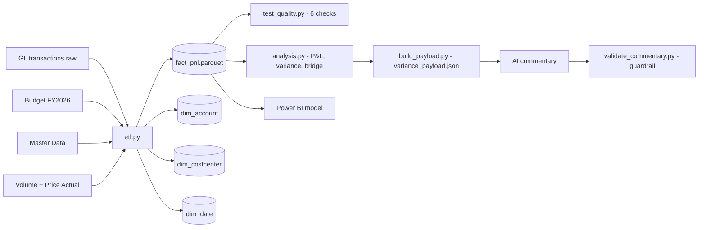

# FP&A Automation Pipeline

Month-end FP&A close rebuilt as code: a Python ETL into a star-schema warehouse, automated data-quality tests, variance and price/volume bridge analysis, a Power BI model on top, and an AI commentary layer that is structurally prevented from inventing numbers.

Dataset: 12 retail stores, 21 monthly periods, 8,546 general-ledger rows — synthetic, but deliberately dirty (duplicate entries, accounts missing from the chart of accounts, unassigned cost centers).

## The problem

A monthly close done by hand in Excel — consolidating GL extracts, mapping accounts to a COA, unpivoting a 12-month budget, building the P&L, computing variances, writing commentary — takes roughly 3-5 hours and leaves no audit trail. Every step is a copy-paste that can break silently, and nothing checks whether the result still ties out.

This pipeline reproduces that close in **4.7 seconds**, with **6 automated data-quality checks** and **zero reconciliation difference**.

## Architecture



The warehouse is a star schema, not a flat extract: `fact_pnl` stores only keys and amounts, so store names, regions and account hierarchies resolve through the dimension tables. Power BI reads the same parquet files, which is what lets the BI layer and the Python layer be reconciled against each other instead of trusted separately.

## Results — September 2026

| Metric | Actual | Budget | Variance |
|---|---|---|---|
| Revenue | 10,506M VND | 10,925M VND | -419M (-3.8%) |
| Gross margin | 43.9% | 45.2% | -1.3 pts |
| EBIT | 546M VND | 851M VND | -306M (-35.9%) |

Price/volume bridge on revenue: **volume effect -393M**, **price effect -23M**. The shortfall is a traffic problem, not a pricing problem — a distinction that changes which lever management pulls, and one a headline variance number alone would hide.

Store-level: ST-01 (-386M), ST-11 (-122M) and ST-09 (-80M) carry most of the miss; ST-06 (+75M) and ST-03 (+49M) beat budget.

## Data quality

Six tests run against the warehouse on every pipeline execution, all passing:

1. Revenue in `fact_pnl` ties to the volume x price source — difference = 0 VND
2. Actual row count after deduplication = 8,546 (34 duplicate GL entries removed)
3. No null periods
4. No null P&L groups (`UNMAPPED` is a valid, explicit bucket; null is not)
5. Every cost-center x account pair has all 12 budget months
6. No null cost centers

Dirty-data handling is explicit rather than silent: 449 rows hit accounts absent from the chart of accounts (Bank Charges, Repairs & Maintenance, Store Supplies) and are routed to an `UNMAPPED` P&L group instead of being dropped, and GL rows with no cost center land in `UNASSIGNED` rather than disappearing from the store-level variance.

## The guardrail

The AI layer does not touch the numbers. `build_payload.py` computes every figure in pandas and writes `variance_payload.json`; the model may only write prose around that payload. `validate_commentary.py` then extracts every number from the generated commentary and checks it against the payload, handling Vietnamese number formatting (period = thousands separator, comma = decimal) and ignoring store codes, dates and years.

Tested in both directions:

```
$ python validate_commentary.py commentary.txt
HALLUCINATION DETECTED: cac so sau khong khop payload goc: [1.3]
```

Caught a number the model derived itself (45.2% - 43.9% = 1.3 pts). Arithmetically correct, but absent from the source payload — exactly the class of quiet error that makes AI-written commentary unusable in a reporting pack.

```
$ python validate_commentary.py commentary.txt
HALLUCINATION DETECTED: cac so sau khong khop payload goc: [999.0]
```

Caught a fabricated figure injected deliberately as a negative test.

```
$ python validate_commentary.py commentary.txt
OK - moi con so trong commentary (19 so) deu khop voi payload.
```

Passes once the commentary cites only payload figures. A guardrail that has never been shown to fail a bad input is not a guardrail, so both directions are part of the test.

## Performance

| Step | Runtime |
|---|---|
| ETL only | 2.63 s |
| Full pipeline (ETL + 6 tests + analysis) | 4.74 s |

Measured with `Measure-Command` on Windows/PowerShell. Manual-close baseline of 3-5 hours is an estimate for equivalent scope (8,546 GL rows, 12-month budget unpivot, COA mapping, P&L build, bridge calculation), not a measured benchmark.

## Repo layout

```
etl.py                    Raw files -> star-schema warehouse (parquet)
test_quality.py           6 data-quality tests
analysis.py               P&L, variance by store, price/volume bridge
build_payload.py          Computes every figure -> variance_payload.json
validate_commentary.py    Hallucination guardrail for AI commentary
commentary.txt            AI-generated commentary (validated)
data/                     Source files
warehouse/                Generated parquet warehouse
```

## Running it

```powershell
pip install pandas pyarrow openpyxl
python etl.py
python test_quality.py
python analysis.py
python build_payload.py
python validate_commentary.py commentary.txt
```
